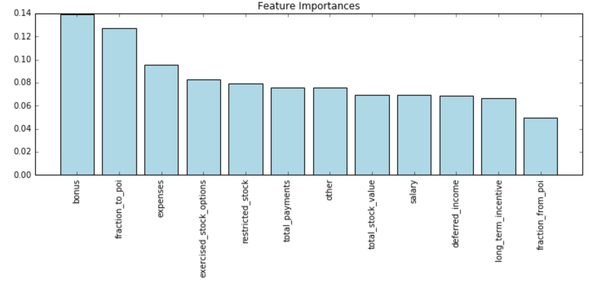

# Identify Fraud from Enron Email
### Q1. Summarize for us the goal of this project and how machine learning is useful in trying to accomplish it. As part of your answer, give some background on the dataset and how it can be used to answer the project question. Were there any outliers in the data when you got it, and how did you handle those?  

The goal of this project is to determine person of interest in Enron dataset by using machine learning.  After training our model, we can predict if new data(new person) is POI or not. Before building machine learning model, we had to explore our data to understand our dataset and to build a good model. 

There are 146 data points which mean there are 146 people in this dataset and 21 features for each data points.  The features  represent financial information( salary, bonus, stock and etc.) and email information(address, from poi, to poi and etc.).  

To find outliers, we made a scatter plot of salary versus bonus. There was data point named ’TOTAL’. I removed this because it is from the sum of rows  and actually this is not a person. Also, I found that 'THE TRAVEL AGENCY IN THE PARK' which is not a person in PDF file. We are looking for person of interest so i removed this data point.

### Q2. What features did you end up using in your POI identifier, and what selection process did you use to pick them? Did you have to do any scaling? Why or why not? As part of the assignment, you should attempt to engineer your own feature that does not come ready-made in the dataset -- explain what feature you tried to make, and the rationale behind it. (You do not necessarily have to use it in the final analysis, only engineer and test it.) In your feature selection step, if you used an algorithm like a decision tree, please also give the feature importances of the features that you use, and if you used an automated feature selection function like SelectKBest, please report the feature scores and reasons for your choice of parameter values.

My final features selection is below.  
['poi', 'salary', 'bonus', 'total_payments', 'long_term_incentive', 'deferred_income','total_stock_value','restricted_stock','exercised_stock_options', 'expenses', 'other', ’fraction_from_poi’, ‘fraction_to_poi’]  

There are too many missing values in restricted_stock_deferred, director_fees, deferral_payments and loan_advances. So, I removed them first. I set up Random Forest Classifier  model and then check feature importance. There is no feature which has too low important to use, so i didn’t remove any features.
  

I created ‘fraction_from_poi’ and ’fraction_to_poi’. 
  
fraction_from_poi = from_poi_to_this_person / to_messages  
fraction_to_poi = from_this_person_to_poi / from_messages  
  
The emails from poi out of total received mails and to poi out of total sent mails will show relationship between poi well.
As we can see above picture new features are pretty important as well.
Also, this makes a dimension reduced.
The difference performances between before creating new features and after creating new features is shown below.
With creating new features, we can get a better model.
  
  
Before New features
- - - -
                   precision    recall  f1-score   support

            0.0       0.95      0.92      0.94        39
            1.0       0.40      0.50      0.44         4

    avg / total       0.90      0.88      0.89        43
  
  
After New features
- - - - 
 
                    precision    recall  f1-score   support

            0.0       0.99      0.92      0.95       135
            1.0       0.39      0.88      0.54         8
    avg / total       0.96      0.92      0.93       143
- - - -

I use standard scaler for a feature scaling at logistic regression model. In logistic regression ,feature scaling makes model better. On the other hand, features scaling made worse in K-Neighbors.

### Q3.What algorithm did you end up using? What other one(s) did you try? How did model performance differ between algorithms? 

GaussianNB 

                   precision    recall  f1-score   support
            0.0       0.92      0.92      0.92        39
            1.0       0.40      0.40      0.40         5

    avg / total       0.86      0.86      0.86        44

Accuracy : 0.863636363636
- - - -
LogisticRegression 

                   precision    recall  f1-score   support
            0.0       0.92      0.95      0.94        38
            1.0       0.60      0.50      0.55         6

    avg / total       0.88      0.89      0.88        44

Accuracy : 0.886363636364
- - - -
SVM 
             
                   precision    recall  f1-score   support
            0.0       1.00      0.89      0.94        44
            1.0       0.00      0.00      0.00         0

    avg / total       1.00      0.89      0.94        44

Accuracy : 0.886363636364
- - - -
KNN 

                   precision    recall  f1-score   support
            0.0       0.97      0.93      0.95        41
            1.0       0.40      0.67      0.50         3

    avg / total       0.94      0.91      0.92        44

Accuracy : 0.909090909091
- - - -
AdaBoost 

                   precision    recall  f1-score   support
            0.0       0.95      0.90      0.92        41
            1.0       0.20      0.33      0.25         3

    avg / total       0.90      0.86      0.88        44

Accuracy : 0.863636363636

I have tried to use support vector machine as my final classifier, first. But it took really long time to optimize parameters. So, i choose KNN and Logistic regression.  My final model is KNN with PCA, because after tuning parameters, it gave me better score especially recall and f1 were higher than logistic regression.

### Q4.What does it mean to tune the parameters of an algorithm, and what can happen if you don’t do this well?  How did you tune the parameters of your particular algorithm? (Some algorithms do not have parameters that you need to tune -- if this is the case for the one you picked, identify and briefly explain how you would have done it for the model that was not your final choice or a different model that does utilize parameter tuning, e.g. a decision tree classifier).

To tune the parameters of algorithm is really important phase. The performance of algorithm is highly related with tuning hyper parameters.
I think that this is similar to tune a radio frequency. we can optimize the performance of algorithm by tuning parameters. 
Without tuning parameters, the algorithm can not give us best prediction or takes very long time to be trained.
The process of tuning my final algorithm is below.

cv = StratifiedShuffleSplit(labels, 100, random_state = 42)
param_grid = [{'reduce_dim__n_components' : [1,2,3,4],
              'clf__n_neighbors' : [3,5,7,9],
              'clf__weights' : ['uniform', 'distance'],
              'clf__algorithm' : ['ball_tree', 'kd_tree', 'brute','auto'],
              'clf__leaf_size' : [30, 10, 15, 20]}]

KN = KNeighborsClassifier()
pca = PCA()

pipe = Pipeline([['reduce_dim',pca],
                 ['clf',KN]])

gs_KN = GridSearchCV(estimator=pipe,
                   param_grid=param_grid,
                   scoring='f1',
                   cv=cv,
                   n_jobs=-1)

I use cross validation set with stratified shuffle split, because our training set is small versus the number of features is 12. 
Note that i used PCA, because KNN usually is susceptible to a curse of dimension.

Outputs are below.

- Score
precision    recall  f1-score   support

        0.0       0.99      0.92      0.95       135
        1.0       0.39      0.88      0.54         8

avg / total       0.96      0.92      0.93       143

- Best estimator:
Pipeline(steps=[['reduce_dim', PCA(copy=True, iterated_power='auto', n_components=3, random_state=None,
  svd_solver='auto', tol=0.0, whiten=False)], ['clf', KNeighborsClassifier(algorithm='ball_tree', leaf_size=30, metric='minkowski',
           metric_params=None, n_jobs=1, n_neighbors=3, p=2,
           weights='uniform')]])

I evaluated each models with f1 score and the reason is in answer to question 6. Number of components to reduce dimension is 3. Ball tree algorithm is best and 30 is best to leaf size. The best number of neighbors is 3 and uniform is best to weights.

### Q5.What is validation, and what’s a classic mistake you can make if you do it wrong? How did you validate your analysis?  

A classic way to use dataset to train algorithm and evaluate the performance of algorithm is split dataset as train and test dataset. Usually, we split  80% and 20% of dataset as train and test dataset.
If we do this to train and evaluate the algorithm, we might choose over-fitted or under-fitted algorithm evaluated by only test data. This cause prediction of model be poor when it predicts  new data which model hasn’t seen.

We can split train dataset into train and validation set again.  Evaluating algorithm with validation set gives us better estimated error, rather than  evaluating algorithm with test data in classic way.  With validation, we can evaluate and choose better algorithm. 

For validation of my model, I used StratifiedKFold cross-validation method with 10 folds which is default and 100 iteration. 

### Q6.Give at least 2 evaluation metrics and your average performance for each of them.  Explain an interpretation of your metrics that says something human-understandable about your algorithm’s performance.

After implementing tester.py, i got results below.

Accuracy: 0.88473	
Precision: 0.63869	
Recall: 0.31200	
F1: 0.41921
Total predictions: 15000

True positives:  354		False positives:  234	
False negatives: 1646		True negatives: 12766

- Accuracy = TP + TN / TOTAL : 0.88473
My final model can predict whether a person is a POI or not  88.473%. 
An accuracy is usually important but not in this dataset, because this dataset is biased which means that the number of POIs actually is really lower than non-POIs. For example, if our model predicted all people were non-POI , an accuracy would be about 87.59% ( (0 + 127) / 145 * 100). So accuracy is not useful in this dataset.

- Precision  = (TP / (FP + TP)) : 0.63869
This is important because we do want to determine if a person is POI.
We don’t want our model to predict actual POIs as non-POI.
The precision of our final model is 63.87%  which means our model can discriminate	 true POIs of whole real POIs.

- Recall = (TP / (FN + TP)) : 0.31200
Recall is also important.  We don’t want our model to predict actual non-POI as POI.
This means that 31.20% of the POIs in the data were correctly identified by the model. In mathematical terms, this is the ratio of true_POIs/(false_non_POIs + true_POIs). This is important because we want to catch as many of the POIs as possible, to make sure they face justice. My model should identify about 5 in 9 of the POIs.

- F1 Score = (2 * (Precision * Recall) / (Precision + Recall)) : 0.41921
Because i want both recall and precision to be high, F1 score was used to tune parameters in GridsearchCV steps.

### References
- Scikit learn documents.
- Python Machine Learning (Book by Sebastian Raschka)
- An Introduction to Statistical Learning (Gareth James, Daniela Witten Trevor Hastie, Robert Tibshirani)

